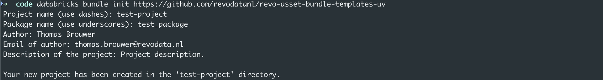

# RevoData Asset Bundle Templates: lightning fast `uv` projects!

[](https://www.python.org)
[](https://github.com/astral-sh/uv)
[](https://github.com/astral-sh/ruff)
[](http://mypy-lang.org/)
[](https://github.com/pre-commit/pre-commit)
[](https://github.com/semantic-release/semantic-release)


[](https://github.com/revodatanl/revo-asset-bundle-templates-uv/actions/workflows/semantic-release.yml)

The `RevoData Asset Bundle Templates: lightning fast uv projects!` repo contains a templates for our lightning fast `uv`-powered Python projects. The template provides a complete development environment for new Python projects, including GitHub Actions, pre-commit hooks, and semantic release.

Although not configured to directly interact with to Databricks (use the original [RevoData Asset Bundle Templates](https://github.com/revodatanl/revo-asset-bundle-templates) for that), the `RevoData Asset Bundle Templates: lightning fast uv projects!` repo is built upon the Databricks CLI for convenience.

Shout out to [Georgel Preput](https://github.com/GeorgelPreput) for providing the foundation for this template, and to [Jesse Schouten](https://github.com/JesseSchouten) for figuring out how `uv` actually works!

## Getting started on MacOS

1. Install the [Databricks CLI](https://docs.databricks.com/dev-tools/cli/databricks-cli) by running the following command:

```bash
brew tap databricks/tap
brew install databricks
```

2. Initialize a new project using the template:

```bash
databricks bundle init https://github.com/revodatanl/revo-asset-bundle-templates-uv
```

This will create a new directory with the template files. You can now start developing your project.



## Getting started on Linux
- Note: ubuntu22.04 as OS in the development process.

1. Install the [Databricks CLI](https://docs.databricks.com/dev-tools/cli/databricks-cli) by running the following command:

```bash
curl -fsSL https://raw.githubusercontent.com/databricks/setup-cli/main/install.sh
```

2. Initialize a new project using the template:

```bash
databricks bundle init https://github.com/revodatanl/revo-asset-bundle-templates-uv
```

This will create a new directory with the template files. You can now start developing your project.


